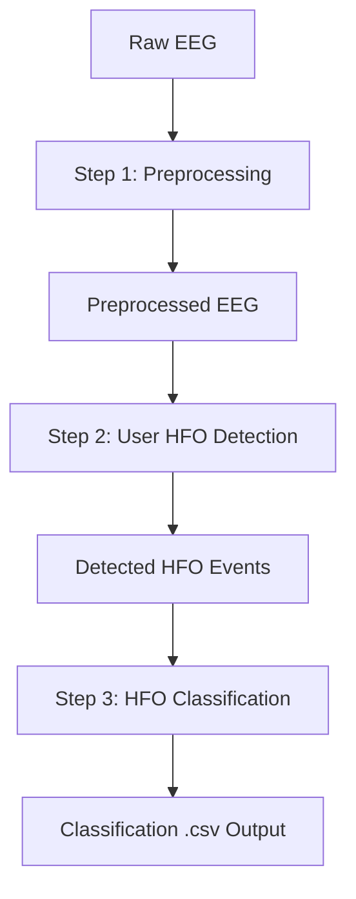

# 🧠 MIAF: Michigan Intracranial Artifact Filter

A modular pipeline for classifying High-Frequency Oscillations (HFOs) in intracranial EEG (iEEG) as **artifactual** or **non-artifactual**. The full pipeline is implemented in **MATLAB**, with a **Python implementation** available for the classification step.

---

# 📘 MASTER OUTLINE

**A. Overview of the Pipeline**  
**B. Repository Structure**  
**C. Installation & Setup**  
**D. Running the Pipeline**  
 D1. Full MATLAB Pipeline  
 D2. HFO Classification Step Only (Python)  
**E. Step-by-Step Usage (1–3)**  
 1. Preprocessing  
 2. User-Defined HFO Detection  
 3. HFO Classification  
**F. Output Files**  
**G. Example Datasets for Visualization**  
**H. Visualizing EEG + HFO Events in EEGLAB**

---

# A. Overview of the Pipeline

The MIAF pipeline consists of **three modular stages**:

1. **EEG Preprocessing**  
   Remove bad channels, apply common average reference (CAR), and bandpass filter signals.

2. **HFO Detection (User-Defined)**  
   You supply your own algorithm that outputs candidate HFO events.

3. **HFO Classification**  
   A logistic regression classifier assigns each event to:  
   - artifact  
   - non-artifactual HFO (naHFO)  
   - invalid



---

# B. Repository Structure

```text
MIAF/
├── input_data/
├── data_for_visualization/
├── matlab/
│   ├── demo_full_pipeline.m
│   ├── preprocess_eeg_for_hfo_detection.m
│   ├── classify_events.m
│   ├── preprocessing/
│   ├── features/
│   ├── classification/
│   ├── utils/
│   └── requirements/
├── python/
│   ├── demo_classify_events.py
│   ├── classify_events.py
│   ├── classification/
│   ├── utils/
│   └── requirements.txt
├── model/
│   └── model.json
└── outputs/
```

Note: The `outputs/` folder is created during runtime and is not tracked in the repository.


---

# C. Installation & Setup

## C1. Obtain the Repository

**Option 1 — Download ZIP**
1. Click **Code → Download ZIP**
2. Extract and open the folder in MATLAB

**Option 2 — Git clone**
```bash
git clone https://github.com/tshibei/MIAF.git
cd MIAF
```

---

## C2. MATLAB Setup

In MATLAB, run from  `matlab/requirements/`:

```matlab
check_requirements
```

---

## C3. Python Setup (optional; classification only)

```bash
python -m venv venv
source venv/bin/activate      # Windows: venv\Scripts\activate
pip install -r python/requirements.txt
```

---

# D. Running the Pipeline

## D1. Run the Full Pipeline in MATLAB

In MATLAB, run all steps (preprocessing, feature extraction, and classification) from `matlab/`:

```matlab
demo_full_pipeline
```

This script:

- Loads example inputs  
- Runs preprocessing  
- Extracts event features  
- Performs HFO classification  
- Writes outputs to the `outputs/` folder  

Generated files include:

- `preprocessed_eeg.mat`  
- `preprocessed_channel_info.mat`  
- `classified_hfo_events.csv`  
- `hfo_event_features.mat`

---

## D2. Run Only the HFO Classification Step in Python

If preprocessing and detection have already been completed, you may run only Step 3 using Python.

Run from `python/`:

```python
python demo_classify_events.py
```

This script:

- Loads detected HFO events  
- Reads preprocessed EEG (MATLAB v7.3 via `h5py`)  
- Extracts features  
- Applies logistic regression using `model.json`  
- Produces the same outputs as the MATLAB version  

MATLAB and Python produce **identical classification results**.

---

# E. Step-by-Step Usage

Below are the pipeline’s three steps in detail.

---

# E1. Step 1 — EEG Preprocessing

Place the following files in `input_data/`:

## Required Inputs

**1. Raw EEG** (`raw_eeg.mat`)  
- Format: MATLAB v7.3  
- Example: `example_raw_eeg.mat`   
- It must contain the variable:

  | Variable | Description |
  |----------|-------------|
  | `data` | **time × channels** matrix of EEG recordings<br>• Minimum recommended duration: ~10 minutes<br>• Rows represent time points, columns represent channels |

**2. Channel Information** (`channel_info.mat`)  
- Example: `example_channel_info.mat`
- It must contain the variables:

  | Variable | Description |
  |----------|-------------|
  | `ecog_chan_idx` | 1-based indices of ECoG channels (column vector), or empty array `[]` if none exist |
  | `depth_chan_idx` | 1-based indices of depth (SEEG) channels (column vector), or empty array `[]` if none exist |

**3. Sampling Rate** (`sampling_rate.mat`)  
- Example: `example_sampling_rate.mat`
- It must contain the variable:
  | Variable | Description |
  |----------|-------------|
  | `fs` | Sampling rate in Hz (float) |

## Run Preprocessing
```matlab
preprocess_eeg_for_hfo_detection( ...
    'input_data_dir',                 'input_data', ...
    'raw_eeg_file',                   'raw_eeg.mat', ...
    'channel_info_file',              'channel_info.mat', ...
    'sampling_rate_file',             'sampling_rate.mat', ...
    'output_dir',                     'outputs', ...
    'preprocessed_eeg_file',          'preprocessed_eeg.mat', ...
    'preprocessed_channel_info_file', 'preprocessed_channel_info.mat');
```

## Generated Outputs

The following outputs are generated in the `outputs/` folder.

### Preprocessed EEG 
`preprocessed_eeg.mat`

 Variable | Description |
|------|-------------|
| `ecog_hfo_raw` | CAR-referenced ECoG signals (raw, unfiltered) |
| `ecog_car_raw` | Common average reference (CAR) signal for ECoG |
| `ecog_hfo_filt` | Bandpass-filtered ECoG signals (80–500 Hz) |
| `ecog_car_filt` | Bandpass-filtered ECoG CAR signal |
| `depth_hfo_raw` | CAR-referenced depth signals (raw, unfiltered) |
| `depth_car_raw` | Common average reference signal for depth channels |
| `depth_hfo_filt` | Bandpass-filtered depth signals (80–500 Hz) |
| `depth_car_filt` | Bandpass-filtered depth CAR signal |

All matrices preserve the original **time × channels** organization.

### Preprocessed Channel Information
`preprocessed_channel_info.mat`

| Field | Description |
|------|-------------|
| `ecog_chan_idx` | 1-based indices of ECoG channels |
| `depth_chan_idx` | 1-based indices of depth (SEEG) channels |
| `good_chan_mask` | Logical vector indicating valid channels (`true` = good, `false` = excluded), determined using automated noise detection via `invalid_epoch_detector` |. 

---

# E2. Step 2 — User-Defined HFO Detection

You may use any HFO detection method. Detection must operate on the following variables from `preprocessed_eeg.mat` in the `outputs/` folder generated in Step 1.

| Variable | Description |
|----------|-------------|
| `ecog_hfo_filt` | [time × channels] matrix of common average referenced and bandpass filtered ECoG channels |
| `depth_hfo_filt` | [time × channels] matrix of common average referenced and bandpass filtered depth channels |

Detection should be performed separately for ECoG and depth channels, and the outputs should be concatenated (see below).

### Required Output

Save the following variables into `detected_hfo_events.mat` in the `input_data/` folder (see example in `example_detected_hfo_events.mat`).


| Variable    | Description                  |
| ----------- | ---------------------------- |
| `start_idx` | Start sample index (1-based), column vector |
| `end_idx`   | End sample index (1-based), column vector   |
| `chan_idx`  | Channel index (1-based), column vector      |

All variables must be column vectors of equal length.

---

# E3. Step 3 — HFO Classification

Available in **both MATLAB and Python**.  

### Model Format (`model.json`)
The model file stored in the `model/` folder, `model.json`, contains a pre-trained logistic regression model stored as a dictionary with the following fields:

| Field          | Type          | Description |
|----------------|---------------|-------------|
| `coefficients` | `List[float]` | Regression weights (β) for each feature, ordered to match `features`. |
| `intercept`    | `float`       | Intercept term (β₀) added to the linear predictor. |
| `threshold`    | `float`       | Probability cutoff for binary classification (e.g., probability ≥ threshold → class 1). |
| `features`     | `List[str]`   | Ordered list of feature names used by the model. |
| `mean`         | `List[float]` | Feature-wise mean values used for z-score normalization. |
| `std`          | `List[float]` | Feature-wise standard deviation values used for z-score normalization. |

In MATLAB, run from `matlab/`
```matlab
classify_events( ...
    'input_data_dir',                 'input_data', ...
    'detected_hfo_events_file',       'detected_hfo_events.mat', ...
    'sampling_rate_file',             'sampling_rate.mat', ...
    'model_dir',                      'model', ...
    'model_file',                     'model.json', ...
    'output_dir',                     'outputs', ...
    'preprocessed_eeg_file',          'preprocessed_eeg.mat', ...
    'preprocessed_channel_info_file', 'preprocessed_channel_info.mat', ...
    'classified_hfo_events_file',     'classified_hfo_events.csv', ...
    'hfo_event_features_file',        'hfo_event_features.mat');
```

Alternatively,

Run Python code from `python/`
```python
python classify_events.py \
   --input-data-dir                 input_data \
   --detected-hfo-events-file       detected_hfo_events.mat \
   --sampling-rate-file             sampling_rate.mat \
   --model-dir                      model \
   --model-file                     model.json \
   --output-dir                     outputs \
   --preprocessed-eeg-file          preprocessed_eeg.mat \
   --preprocessed-channel-info-file preprocessed_channel_info.mat \
   --classified-hfo-events-file     classified_hfo_events.csv \
   --hfo-event-features-file        hfo_event_features.mat
```

---

# F. Output Files

## F1. Feature Matrix  
`outputs/hfo_event_features.mat`

| Variable | Description |
|----------|-------------|
| `X` | [events × features] matrix of extracted features for each detected HFO event<br>• Rows represent individual HFO events<br>• Columns represent feature values used for classification |

---

## F2. Classification CSV  
`outputs/classified_hfo_events.csv`


| Column               | Description           |
| -------------------- | --------------------- |
| `start_idx`          | Event start index     |
| `end_idx`            | Event end index       |
| `chan_idx`           | Channel               |
| `prob_HFO`           | Predicted probability |
| `is_HFO_thresh_0_95` | Binary label          |
| `is_bad_chan`        | 1 = bad channel, 0 = good channel       |
| `is_nan_event`       | 1 = invalid event (invalid scores or event detected on bad channels), 0 = valid event           |

---

# G. Example Datasets for Visualization

Located in:

```
data_for_visualization/
```

Each example contains:

1. `example_raw_eeg_{n}.set`: EEG signals  
2. `example_detected_hfo_events_{n}.set`: Detected HFO events with ground-truth labels (brain / artifact) 
3. `example_classified_hfo_events_{n}.set`: MIAF-classified HFO events with classification labels (artifact / non-artifactual HFO (naHFO) / invalid)

These are EEGLAB `.set` datasets for visualization only.

---

# H. Visualizing EEG + HFO Events in EEGLAB

## H1. Install EEGLAB
Download from:  
https://sccn.ucsd.edu/eeglab/download.php

## H2. Load the Example Datasets
1. In EEGLAB: **File → Load existing dataset(s)**  
2. Open the `.set` files in `data_for_visualization/`

## H3. View EEG & Event Markers
Open the scroll viewer:  
**Plot → Channel data (scroll)**

Use the arrows to scroll through the EEG.

## H4. Example EEG Epochs and Classifier Behavior
Three representative EEG epochs are shown to illustrate how the classifier behaves under different signal conditions:

### Example 1 — Clear Artifact

This epoch contains one labeled artifact that is visually obvious.
The classifier successfully identified the labeled artifact as well as additional unlabeled artifacts present in the segment. This demonstrates the model’s ability to generalize to artifact morphology even beyond the manually labeled examples.

### Example 2 — Brain-Generated HFO

This epoch includes one labeled HFO arising from neural activity.
The classifier correctly identified the labeled HFO; however, several additional brain-generated HFOs occurring within a brief window were misclassified as artifacts. These HFOs are subtle and not superimposed on clear spikes, making them difficult to distinguish from artifacts, especially given that the detector was tuned conservatively to prioritize artifact removal.

### Example 3 — Mixed Muscle Artifacts and HFOs

This epoch contains a mixture of muscle artifacts and brain-generated HFOs.
A scalp EEG trace is also displayed for reference. Prominent HFOs appear on sharp waves, but significant muscle activity is present as well, making it difficult to differentiate the two using a single channel alone. The classifier successfully distinguished the muscle artifacts from the brain-generated HFOs.

---

# 📄 License
See **LICENSE.md** for full license details.
